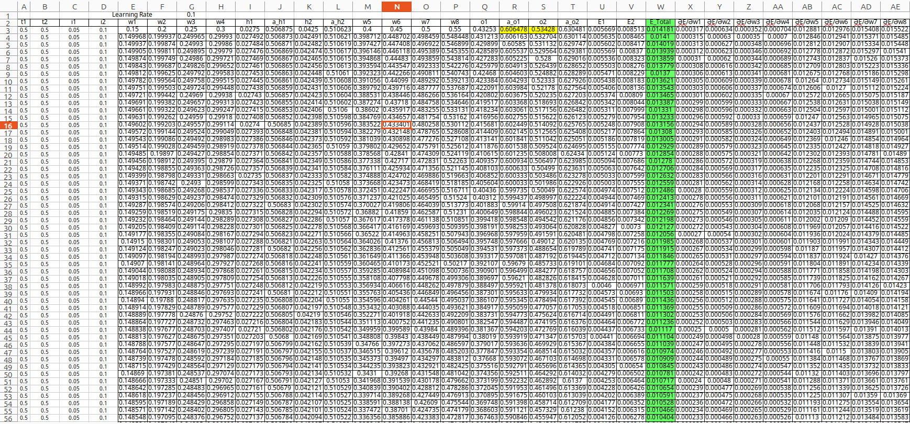

# ERA 2 Session 6 : Backpropagation Part 1 

### 1.1 Introduction

- In this article we will detail out the working of backpropogation and related calculations using Excel Hseet  
- In this example we have considered sinple neural network consisting of 3 types of layers
  - Input layer
  - Hidden layers
  - Output layer
- In general, there are multiple hidden layers in neural networl and each layer consists of multiple neurons and there is weights associated with each neuron.
- In FC layer(fully connected layer)/dense layer, each neuron or node in the layer is connected to every neuron in the preceding and succeeding layers. In  other words, all the nodes in one layer have connections to all the nodes in the adjacent layers. We can say, each neuron in respective hidden layer has 'N'  number of weights associated with it, Where, `'N' is the number of neurons in the previous layer
- For a convolutional layer, each kernel will have `length*width` number of weights associated with it.


### 1.2 One layer Neural Network Overview

- To understand the gradient/parameter calculation at each step is complicated task. Therefore, a simple neural network with  hidden layers and  input layer used.


- In the above architecture,
  - `i1` and `i2` are the input neurons
  - `h1` and `h2` are the hidden layer for the temporary values to calculated based on the weights and input
  - `a_h1` and `a_h2` are the activation function(Sigmoid) for `h1` and `h2`
  - w1, w2, w3, and w4 are the weights for the first hidden layer
  - `o1` and `o2` are the temporary values calculated based on the weights and first hidden layer output
  - `a_o1` and `a_o2` are activation function(Sigmoid) for `o1` and `o2`
  - w5, w6, w7, and w8 are the weights for the second hidden layer
  - `t1` and `t2` are the ground truth values for the output from `a_o1` and `a_o2`
  - `E1` is the error value calculated using the ground truth output and model output for `o1`
  - `E2` is the error value calculated using the ground truth output and model output for `o2`

### 1.3 Forward propogation Steps

- The above network receives the inputs `i1` and `i2`. 

  ```python
  i1 = 0.05
  i2 = 0.1
  ```

- Initally below weights are initialized  and subsequently their values will be updated during training. Although in actual nwtwok the weight are initialized randomly

  ```python
  w1 = 0.15
  w2 = 0.2
  w3 = 0.25
  w4 = 0.3
  w5 = 0.4
  w6 = 0.45
  w7 = 0.5
  w8 = 0.55
  ```

- Forward propogation : The hidden layer neurons values `h1` and `h2` are calculated based on the input values and the weights of the hidden layer. Similarly, values for the output layer neurons `o1` and `o2` are calculated based on output of hidden layers and the weights of the output layer.

  ```python
  # For Hidden Layer
  h1 = w1 * i1 + w2 * i2
  h2 = w3 * i1 + w4 * i2
  
  # For Output Layer
  o1 = w5 * a_h1 + w6 * a_h2
  o2 = w7 * a_h1 + w8 * a_h2


- The above equations are linear and we know from Session6 limitation of linear function which are 
    - linear activation function turns the neural network into just one layer, though we may have loat of layers
    - Not possible to do the back propogation because the devative of function is constant which has no relation with input.

- Therefore there is need to introduce non linearity. We are using sigmoid function as non linear activation function.

  ```python
  # For Hidden Layer
  a_h1 = sigmoid(h1) = 1 / (1 + exp(-h1))
  a_h2 = sigmoid(h2) = 1 / (1 + exp(-h2))
  
  # For Output Layer
  a_o1 = sigmoid(o1) = 1 / (1 + exp(-o1))
  a_o2 = sigmoid(o2) = 1 / (1 + exp(-o2))
  ```

- Now we can summarize the data flow in forward direction as:
Inputs > Hidden layer Neuron > Sigmoid activation of hidden layer > output layer > activation of output layer > Final output

- The expected/target output for the input values are `a_o1` = `t1`  and `a_o2` = `t2`. In this case both are 0.5

- Referring to ERA2_Assignment6_Part1.xlsx LR=0.1 tab, the value found are `a_o1` = 0.6064 and `a_o2` = 0.5342 

- Since the calulated values are not matching with ground truth, need to calculate the error `E1` and `E2` for `a_o1` and `a_o2` respectively

  ```python
  E1 = 1/2 * (t1 - a_o1)**2
  E2 = 1/2 * (t2 - a_o1)**2
  ```
  
- The total error for one epoch and one sample of input, is the sum of `E1` and `E2`

  ```python
  E_total = E1 + E2
  ```

### 1.4 Back Propogation/Gradient Calculations Steps
- Since we found error for sample input, we need to tweak network in such a way that it minimizes the error. Also Error is dependent on input values and weights.

- Since input to the network can not be changed, therefore we need to adjust the weights in such way that model start predicting correct output values. The weights can not be randomly changed and needs to adjusted in a systematic manner. 

- From the above equations, it is clear that the change in hidden layer weight will affect the output of the activation(Sigmoid) neuron of output layer.

- All the weights are interconnected in a chained way that is changing one will change the outputs of all the succeeding values in the chain

- As weights can not be randomly changed and need to how much each weight is affecting the output. Therefore we need to change the weights based on the error values

- Backpropagation is techinque for gradients calculation i.e. by how much value, each weight should be changed in order to minimize the error

- Also, how sensitive is the cost function (E_total) to the changes in the weights i.e. derivate of `E_total` with respect to weights

- Step 1: Calculating of gradients for the weights of the output layer since it is closest to the output

  ```text
  ∂E_total/∂w5 = ∂(E1 + E2)/∂w5
  ∂E_total/∂w5 = ∂E1/∂w5
  ```

- The change in `w5` will cause some change `o1`, which causes some changes to `a_o1` which directly influences the cost

- Step 2: The sensitivity of `E_total` to small changes in `w5` can be calculated by using chain rule

  ```text
  ∂E_total/∂w5 = ∂E1/∂w5 = ∂E1/∂a_o1*∂a_o1/∂o1*∂o1/∂w5					
  ```

- Step 3: After calculating the derivates, the values are:

  ```
  ∂E1/∂a_o1 =  ∂(½ * (t1 - a_o1)²)/∂a_o1 = (a_01 - t1)					
  ∂a_o1/∂o1 =  ∂(σ(o1))/∂o1 = a_o1 * (1 - a_o1)					
  ∂o1/∂w5 = a_h1					
  ```

  and thus the partial derivative/sensitivity of `E_total` to small change in `w5` is given by:

  ```
  ∂E_total/∂w5 = (a_01 - t1) * a_o1 * (1 - a_o1) *  a_h1					
  ```

- Step 4: Similarly, the sensitivity of `E_total` to small change in `w6`, `w7` and `w8` is given by:

  ```latex
  ∂E_total/∂w6 = (a_01 - t1) * a_o1 * (1 - a_o1) *  a_h2					
  ∂E_total/∂w7 = (a_02 - t2) * a_o2 * (1 - a_o2) *  a_h1					
  ∂E_total/∂w8 = (a_02 - t2) * a_o2 * (1 - a_o2) *  a_h2					
  ```

- Step 5: Similarly, to calculate the sensitivity of `E_total` to small change in `w1`, `w2`, `w3`, and `w4`, first we need to calculate it with respect to `a_h1` and `a_h2`(Step 3):

  ```
  ∂E1/∂a_h1 = (a_01 - t1) * a_o1 * (1 - a_o1) * w5								
  ∂E2/∂a_h1 = (a_02 - t2) * a_o2 * (1 - a_o2) * w7								
  ∂E_total/∂a_h1 = (a_01 - t1) * a_o1 * (1 - a_o1) * w5 +  (a_02 - t2) * a_o2 * (1 - a_o2) * w7			
  ∂E_total/∂a_h2 = (a_01 - t1) * a_o1 * (1 - a_o1) * w6 +  (a_02 - t2) * a_o2 * (1 - a_o2) * w8			
  ```

  Step 6: Need to go further inside the network, to calculate with respect to weights

  ```
  ∂E_total/∂w1 = ∂E_total/∂a_h1 * ∂a_h1/∂h1 * ∂h1/∂w1					
  ∂E_total/∂w2 = ∂E_total/∂a_h1 * ∂a_h1/∂h1 * ∂h1/∂w2					
  ∂E_total/∂w3 = ∂E_total/∂a_h2 * ∂a_h2/∂h2 * ∂h2/∂w3
  ∂E_total/∂w4 = ∂E_total/∂a_h2 * ∂a_h2/∂h2 * ∂h2/∂w4
  ```

  Step 7: Substituting above values:

  ```
  ∂E_total/∂w1 = ((a_01 - t1) * a_o1 * (1 - a_o1) * w5 +  (a_02 - t2) * a_o2 * (1 - a_o2) * w7) * a_h1 * (1 - a_h1) * i1												
  ∂E_total/∂w2 = ((a_01 - t1) * a_o1 * (1 - a_o1) * w5 +  (a_02 - t2) * a_o2 * (1 - a_o2) * w7) * a_h1 * (1 - a_h1) * i2												
  ∂E_total/∂w3 = ((a_01 - t1) * a_o1 * (1 - a_o1) * w6 +  (a_02 - t2) * a_o2 * (1 - a_o2) * w8) * a_h2 * (1 - a_h2) * i1												
  ∂E_total/∂w4 = ((a_01 - t1) * a_o1 * (1 - a_o1) * w6 +  (a_02 - t2) * a_o2 * (1 - a_o2) * w8) * a_h2 * (1 - a_h2) * i2												
  ```

- Step 8: Finally, sensitivity of E_total to small change in all the weights is given by:

  ```
  ∂E_total/∂w1 = ((a_01 - t1) * a_o1 * (1 - a_o1) * w5 +  (a_02 - t2) * a_o2 * (1 - a_o2) * w7) * a_h1 * (1 - a_h1) * i1												
  ∂E_total/∂w2 = ((a_01 - t1) * a_o1 * (1 - a_o1) * w5 +  (a_02 - t2) * a_o2 * (1 - a_o2) * w7) * a_h1 * (1 - a_h1) * i2												
  ∂E_total/∂w3 = ((a_01 - t1) * a_o1 * (1 - a_o1) * w6 +  (a_02 - t2) * a_o2 * (1 - a_o2) * w8) * a_h2 * (1 - a_h2) * i1												
  ∂E_total/∂w4 = ((a_01 - t1) * a_o1 * (1 - a_o1) * w6 +  (a_02 - t2) * a_o2 * (1 - a_o2) * w8) * a_h2 * (1 - a_h2) * i2	
  ∂E_total/∂w5 = (a_01 - t1) * a_o1 * (1 - a_o1) *  a_h1					
  ∂E_total/∂w6 = (a_01 - t1) * a_o1 * (1 - a_o1) *  a_h2					
  ∂E_total/∂w7 = (a_02 - t2) * a_o2 * (1 - a_o2) *  a_h1					
  ∂E_total/∂w8 = (a_02 - t2) * a_o2 * (1 - a_o2) *  a_h2					
  ```

- This is a the intial step to train the model. Once the gradients are calculated, the weights can be updated and check if the loss is decreasing i.e. model is learning. These calculations are added in the excel sheet ERA2_Assignment6_Part1.xlsx. 



### 1.5 Weight Update

- In actual neural network code, the optimizer takes these gradients and update the weights

- Below is euqation for update the weights

  ```
  Updated weights = weights - Learning rate * gradients for the weight
  ```

- Therefore the weight `w1` becomes

  `w1_updated` = `w1` - learning_rate * gradients for w1

  If the learning tate is 0.1, the updated weight becomes

  ```
  w1_updated = 0.15 - 0.1 * 0.000315
  w1_updated = 0.1499685
  ```

- Similarly, all the weights are updated and followed by gradient calculation step is repeated based on the updated weights

- After updating all the weights, error is calculated and it is reduced from 0.01418 to 0.01410 for second epoch


- In excel, total no of epoch considered is 300 and below is Loss Vs Epoch graph showing the reduction is error.


- in attached Loss VS Epoch graph, as learning rate increases, model is converging quicker becuase loss is reducing quickly

- When the learning rate is increased(LR = 1/LR = 2) beyond the a certain value, the model is not able to converge quickly becuase the loss value is not decreasing fast


