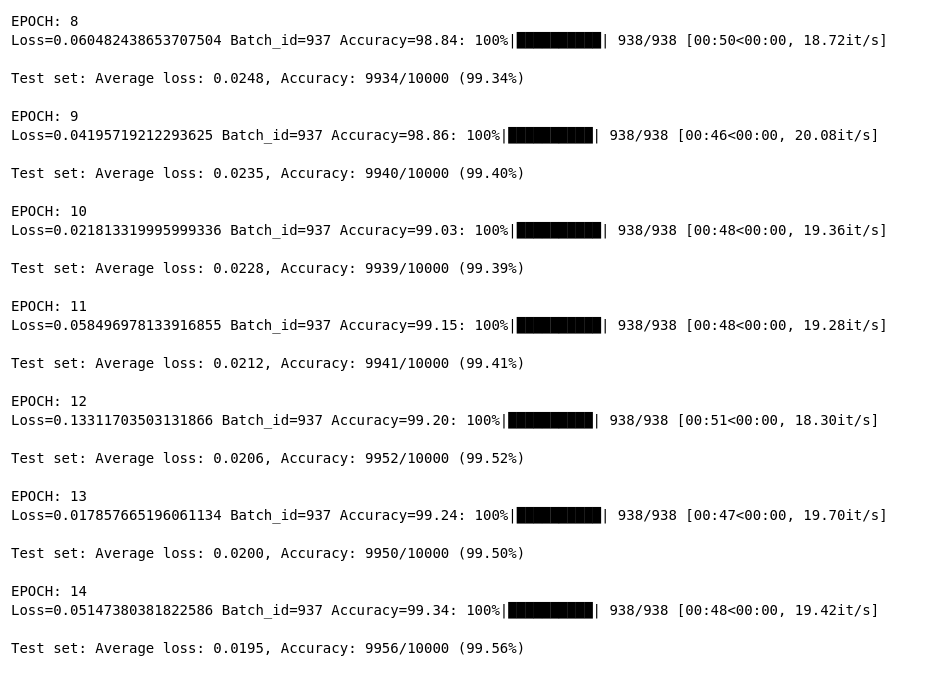
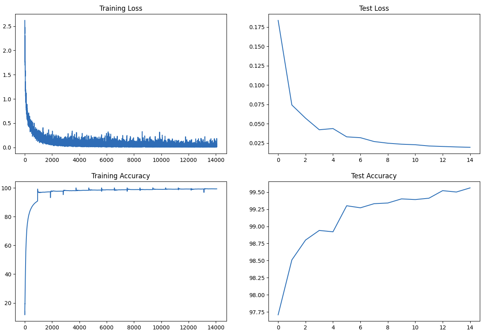

# ERA 2 Session 6 : Backpropagation Part 2 

### Introduction

Training a model using MNIST data is a straightforward process. Essentially, it involves creating a classification model designed to analyze an image and accurately predict the handwritten digit it contains. However, to inject a bit of enjoyment, we've introduced certain constraints. Before delving into the code, let's first familiarize ourselves with the model's input, output, and architecture. This is how the structure of the README has been organized.

### Input
MNIST data comprises images depicting handwritten digits.

- Constraints    Keep the parameters under 20,000.
- Execute the model precisely for 19 epochs.
- Incorporate Batch Normalization, FC Layer, Dropout, and GAP.
- Utilize a 1x1 kernel to showcase the efficacy of deep learning without imposing excessive strain on the GPU, essentially streamlining the process.
    
### Network 
- The network comprises approximately four sets of convolutional blocks, each containing 2 to 3 convolution blocks, followed by transition block (containing Maxpool layers), Global Average Pooling (GAP) layer, and Fully Connected (FC) layer.

#### Typical Structure 
- Convolution Layer of 3 x 3 Kernel with Padding of 1 
- ReLu - Activation Function
- Batch Normalization - Regularization Parameter
- Dropout             - Regularization Parameter 
- Maxpool after 3 Layers 

- Example 
self.conv1 = nn.Sequential(
            nn.Conv2d(1, 4, 3, padding=1, bias=False),
            nn.ReLU(),
            nn.BatchNorm2d(4),
            nn.Dropout2d(p=dropout_value)
        )

- Global Average Pooling: A pooling operation that computes the average value of each feature map across its entire spatial dimensions, resulting in a single value per feature map.

- Flatten: The process of transforming a multidimensional tensor (2D or 3D) into a one-dimensional tensor before sending to fully connected layers.

- Fully Connected Linear Layer: A layer in a neural network where each neuron is connected to every neuron in the previous layer, performing a linear transformation on the input data. 

#### Constraint
- The Maxpool layers are positioned to achieve a receptive field of 7x7 or 9x9, with a preference for 11x11 for more complex datasets like ImageNet. However, given the simplicity of the MNIST dataset, a 7x7 receptive field is deemed sufficient. This is further replaced  GAP with aim to reduce complexity of model and parameters

- Remove ReLu, Batch Normalization (BN), or Dropout in the final layers of the network.

- Use for minimal parameters, approaching the lower limit of 20,000.

- Apply a Dropout rate best suited

- Implement Batch Normalization for improved training stability.

- Utilize a batch size of 138/64 during training. 

#### Output
- Achieve an accuracy of greater than or equal to 99.4% within 20 epochs.

#### Training Details
- The validation accuracy of 99.56 is acheieved in 10 epoch onwards.
- At first we creted the ligher model.
- BN and dropout is applied to come with efficient and fast converging network.
- GAP is used to reduce complexity of model and parameters.
- To  increase the model's capacity by altering structure like reducing number of channel and adding some 1*1 conv layer. 
- After reducing the number of channels and adding some layer in specific points, the number of parameter increased to 7884 which is below 8k and accuracy also increased to 99.2+ which is far better than previous experiment(98.72).
- Reducing the batch size helps to understand nuances in the data
- After fine tuning like like removing dropout has increased the model accuracy to 99.36
- There is drop in accuracy from last training, may be because of data augmentation.
- With OneCycle LR scheduler, the target of 99.40% is achieved consistently from 11th epoch onwards 
###### Training logs 

The network is trained with Batch Normalization, Dropout,GAP and Once Clycle Policy and accuracy is greater than 99.4 %. The loss and accuracy curve is almost smooth except little spikes in validation data but eventually it is smooth at the end

  

Thank you.